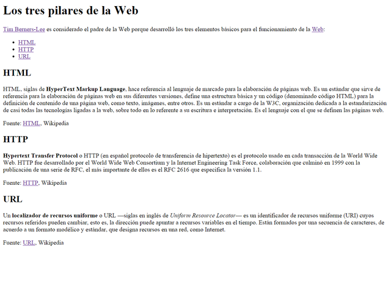

# Exercicios
## Encabezados
### Enunciado
> En el código base que se te proporciona debes realizar los siguientes cambios:

-   Las siglas HTML deben aparecer como texto destacado en toda la página.
-   Tim Berners-Lee debe aparecer como texto enfatizado en toda la página.
-   Debes añadir el siguiente contenido:
    -   Un encabezado de nivel 1 con el texto "HTML" antes de "HTML son las siglas de..."
    -   Un encabezado de nivel 2 con el texto "Historia de HTML" antes de "Los inicios del lenguaje HTML..."
    -   Un encabezado de nivel 2 con el texto "Versiones de HTML" antes de dos nuevos párrafos que contienen el texto "Tim Berners-Lee definió la primera versión de HTML en el año 1991" y "En la actualidad, la última versión de HTML es HTML5".


Clica no seguinte documento html :  [exercicio1.html](../HTML/exercicio1.html)


## Listas
### Enunciado
> A partir del texto que se te proporciona, debes crear una página web que tenga el mismo aspecto que la siguiente imagen.

- Además, tienes que tener en cuenta los siguientes requisitos:

- El título de la página debe ser Curriculum Vitae de Bruce Wayne.
El resto de la estructura de la página debes deducirlo a partir de la imagen proporcionada.


````
Curriculum Vitae de Bruce Wayne

Datos personales
 Nombre completo:  Bruce Wayne
 Fecha de nacimiento: 1/5/1939
 Lugar de nacimiento:  Gotham City

Formación académica
 1956-1961: Universidad del Espantapájaros
 1952-1956: Instituto de Dos Caras
 1944-1952:  Escuela Primaria del Joker

Experiencia laboral
 1975-1985: En el paro
 1965-1975: Cazavillanos y demás chusma
 1962-1965: Aprendiz de superhéroe
````


## Enlaces
### Enunciado
> A partir del texto que se te proporciona, debes crear una página web que tenga el mismo aspecto que la siguiente imagen:
> 
>
> 
> Además, tienes que tener en cuenta los siguientes requisitos:

-   El título de la página debe ser Los tres pilares de la Web.
-   Los enlaces que aparecen en la página deben tener los siguientes destinos:
    -   Tim Berners-Lee → http://es.wikipedia.org/wiki/Tim_Berners-Lee
    -   Web → http://es.wikipedia.org/wiki/World_Wide_Web
    -   HTML → enlace intradocumental al epígrafe HTML
    -   HTTP → enlace intradocumental al epígrafe HTTP
    -   URL → enlace intradocumental al epígrafe URL
    -   Fuente: HTML → http://es.wikipedia.org/wiki/HTML
    -   Fuente: HTTP → http://es.wikipedia.org/wiki/Hypertext_Transfer_Protocol
    -   Fuente: URL → http://es.wikipedia.org/wiki/Localizador_de_recursos_uniforme